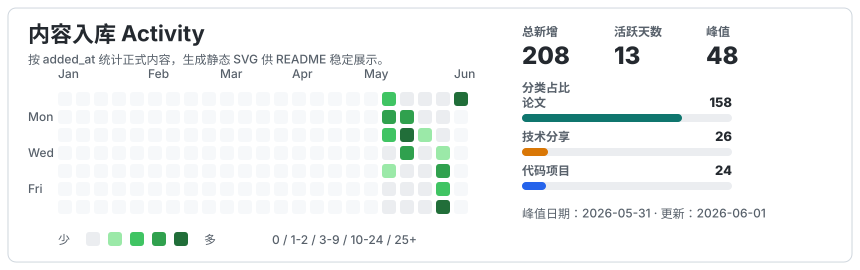
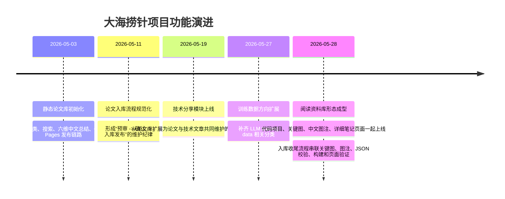

# 大海捞针

在线网页：https://whosaytree.github.io/papers_never_read/

目标仓库：`whosaytree/papers_never_read`

`大海捞针` 是一个按两级目录组织的个人静态论文库。它最初只用于维护论文卡片，现在已经扩展成一个长期阅读资料库：论文、技术分享、代码项目、关键图、详细笔记和 GitHub Pages 自动部署都在同一个仓库里维护。

## 当前状态

截至本次 README 更新：

- 论文库：121 篇正式论文
- 技术分享：5 篇正式记录
- 代码项目：3 个正式项目
- 关键图：118 篇论文已挂载关键图或关键表
- 详细笔记：1 篇论文已挂载独立 Markdown 笔记页
- 一级分类：21 个

页面由 `scripts/build_site.py` 生成，部署到 GitHub Pages。推送到 `main` 后，`.github/workflows/deploy-pages.yml` 会自动构建 `dist/` 并发布。

## 功能概览

- 论文库：两级分类导航、全文搜索、六维中文总结、标签、关键词、代码链接、我的备注、Abstract 展开。
- 关键图：每篇论文可以挂载一张代表性 Figure/Table，并显示英文 caption、中文 caption、页码、置信度和人工复核提示。
- 详细笔记：长笔记放在 `docs/paper_notes/{paper_id}.md`，构建时转成 `dist/paper_notes/{paper_id}.html`，论文卡片展示入口。
- 技术分享：记录文章链接、来源、标签、摘要、关键要点、关键语句、难度标准、我的备注和关联论文。
- 代码项目：记录 Repo/Homepage/Docs/Demo、来源、类型、领域、标签、技术栈、亮点、适用场景、使用备注、许可证、维护状态和关联内容。
- 静态部署：不需要后端服务，所有内容由 JSON 和 Markdown 构建成单页静态网站。

## 目录结构

```text
.
├── .github/workflows/deploy-pages.yml   # GitHub Pages 自动部署
├── assets/paper_images/                 # 论文关键图和关键表图片
├── data/
│   ├── library.json                     # 论文主数据
│   ├── blogs.json                       # 技术分享数据
│   ├── projects.json                    # 代码项目数据
│   ├── review_template.json             # 论文待审模板
│   ├── blog_template.json               # 技术分享待审模板
│   └── project_template.json            # 代码项目待审模板
├── docs/
│   ├── key_figure_extraction_report.md  # 关键图抽取方案说明
│   └── paper_notes/                     # 详细论文笔记 Markdown
├── prompts/                             # 总结、分类、关键图选择相关 prompt
└── scripts/
    ├── build_site.py                    # 生成静态页面
    ├── key_figure_pipeline.py           # 单篇论文关键图发现/选择
    ├── backfill_key_figures.py          # 批量补关键图
    └── finalize_paper_entry.py          # 新论文入库后的收尾检查脚本
```

## 数据模型

### 论文

主文件：`data/library.json`

模板：`data/review_template.json`

核心字段：

- `id`: 本地唯一 ID，建议使用短 slug。
- `title`, `paper_url`, `authors`, `venue`, `year`: 论文基础信息。
- `primary_area`, `category`: 一级分类和二级分类，必须和 `taxonomy` 对齐。
- `keywords`, `labels`: 检索关键词和个人标签。
- `tldr`: 一句话定位。
- `abstract`: 原文摘要。
- `summary_cn`: 固定六维中文总结：研究动机、解决问题、现象分析、主要方法、数据集与实验、主要贡献。
- `note`: 我的备注。默认留空，只有明确提供个人观察时才填写。
- `code_url`: 代码仓库链接。
- `key_figure`: 可选关键图/表元数据。
- `analysis_note`: 可选详细笔记入口。
- `status`: `approved` 才会进入线上页面。
- `added_at`: 入库日期。

`key_figure` 字段结构：

```json
{
  "type": "Figure",
  "name": "1",
  "page": 1,
  "path": "assets/paper_images/example-figure-1.png",
  "caption": "English caption",
  "caption_cn": "中文图注",
  "bbox": {},
  "caption_bbox": {},
  "source": "pdffigures2-local-jar",
  "confidence": 0.82,
  "needs_manual_review": false,
  "contexts": []
}
```

`analysis_note` 字段结构：

```json
{
  "title": "详细笔记：论文简称或主题",
  "source": "docs/paper_notes/{paper_id}.md",
  "url": "paper_notes/{paper_id}.html"
}
```

长笔记只写入 Markdown，不塞进 `summary_cn`、`tldr` 或 `note`。线上卡片保留短总结，详细推导、实验细节、复现状态和个人判断写入 `docs/paper_notes/`。

### 技术分享

主文件：`data/blogs.json`

模板：`data/blog_template.json`

核心字段：

- `id`, `title`, `url`, `source`, `published_at`, `added_at`
- `tags`
- `summary`
- `key_points`
- `standards`: 可选标准表，例如难度标准、评估标准、分级标准。
- `quotes`: 关键语句，每项包含 `text` 和 `note`。
- `my_note`
- `related_papers`: 关联 `data/library.json` 中的论文 `id`。
- `status`: `approved` 才会进入页面。

### 代码项目

主文件：`data/projects.json`

模板：`data/project_template.json`

核心字段：

- `id`, `name`, `repo_url`, `homepage_url`, `docs_url`, `demo_url`
- `source`, `added_at`
- `project_type`, `domain`
- `tags`, `stack`
- `summary`
- `highlights`
- `use_cases`
- `setup_note`
- `license`, `maintenance`
- `my_note`
- `related_papers`, `related_blogs`
- `status`: `approved` 才会进入页面。

## 构建与部署

本地构建：

```bash
python3 scripts/build_site.py
open dist/index.html
```

GitHub Pages 部署：

1. 提交并推送到 `main`。
2. GitHub Actions 运行 `python3 scripts/build_site.py`。
3. 上传 `dist/`。
4. 部署到 GitHub Pages。

首次启用时，GitHub 仓库 Settings 里的 Pages source 需要设置为 `GitHub Actions`。

## 新增论文工作流

新增论文必须分成两个阶段：预审和入库发布。

### 预审阶段

用户只发论文题目或链接时，默认只做预审。

预审阶段必须遵守：

- 不修改 `data/library.json`
- 不运行构建脚本
- 不提交、不推送
- 用 Markdown 给出人工可审阅版本
- 不把 JSON 作为主要审阅格式直接输出

预写入版必须包括：

- 标题
- 论文链接
- 一级分类 / 二级分类
- 作者 / venue / 年份
- TL;DR
- 六维中文总结
- 标签
- 关键词
- 代码仓库
- 我的备注
- Abstract
- 如能获取，补充候选关键图/表说明

### 入库发布阶段

只有用户明确说“确认”“加入网页”“入库”“发布”等指令后，才进入入库发布。

入库发布阶段必须完成：

1. 将确认后的内容写入 `data/library.json`。
2. 将 `status` 设为 `approved`。
3. 设置 `added_at` 为当天日期。
4. 如需要详细笔记，将 Markdown 写入 `docs/paper_notes/{paper_id}.md`，并在论文条目中添加 `analysis_note`。
5. 运行论文收尾脚本：

```bash
python3 scripts/finalize_paper_entry.py --paper-id "{paper_id}" --caption-cn "中文图注"
```

如果暂时无法抽取关键图，可显式允许缺失：

```bash
python3 scripts/finalize_paper_entry.py --paper-id "{paper_id}" --allow-missing-key-figure --allow-missing-caption-cn
```

`finalize_paper_entry.py` 会负责：

- 查找目标论文条目
- 如缺少关键图，调用 `backfill_key_figures.py` 的单篇处理逻辑
- 尝试通过 pdffigures2 抽取代表性 Figure/Table
- 写入或检查中文图注 `caption_cn`
- 校验 `data/library.json`
- 运行 `scripts/build_site.py`
- 检查 `dist/index.html` 中是否包含论文标题、关键图路径和中文图注

完成本地检查后继续：

1. 检查 `dist/index.html` 中能搜索到新增论文。
2. 如果本次包含详细笔记，确认 `dist/paper_notes/{paper_id}.html` 已生成，且论文卡片链接可打开。
3. 提交并推送到 `main`。
4. 等待 GitHub Actions `Deploy Pages` 成功。
5. 最后回复线上链接、提交信息和部署状态。

只有完成推送并确认 GitHub Pages 部署成功，才算新增到线上网页。

## 新增技术分享工作流

新增技术分享也采用预审和入库发布两个阶段。

预审阶段必须遵守：

- 不修改 `data/blogs.json`
- 不运行构建脚本
- 不提交、不推送
- 用 Markdown 给出人工可审阅版本

预写入版必须包括：

- 标题
- 原文链接
- 来源 / 发布时间
- 标签
- 主要内容
- 关键要点
- 关键语句：原文短摘录和理解说明
- 如适用，补充标准表
- 我的备注
- 关联论文建议

入库发布阶段必须完成：

1. 将确认后的内容写入 `data/blogs.json`。
2. 将 `status` 设为 `approved`。
3. 设置 `added_at` 为当天日期。
4. 运行 `python3 -m json.tool data/blogs.json` 检查 JSON。
5. 运行 `python3 scripts/build_site.py` 本地构建。
6. 检查 `dist/index.html` 中能搜索到新增技术分享。
7. 提交并推送到 `main`。
8. 等待 GitHub Actions `Deploy Pages` 成功。

## 新增代码项目工作流

新增代码项目也采用预审和入库发布两个阶段。

预审阶段必须遵守：

- 不修改 `data/projects.json`
- 不运行构建脚本
- 不提交、不推送
- 用 Markdown 给出人工可审阅版本

预写入版必须包括：

- 项目名称
- 项目链接：Repo / Homepage / Docs / Demo
- 来源
- 项目类型 / 领域
- 标签 / 技术栈
- 项目定位
- 亮点
- 适用场景
- 安装或使用备注
- 许可证 / 维护状态
- 我的备注
- 关联论文建议
- 关联技术分享建议

入库发布阶段必须完成：

1. 将确认后的内容写入 `data/projects.json`。
2. 将 `status` 设为 `approved`。
3. 设置 `added_at` 为当天日期。
4. 运行 `python3 -m json.tool data/projects.json` 检查 JSON。
5. 运行 `python3 scripts/build_site.py` 本地构建。
6. 检查 `dist/index.html` 中能搜索到新增代码项目。
7. 提交并推送到 `main`。
8. 等待 GitHub Actions `Deploy Pages` 成功。

## 关键图流水线

关键图能力由三个脚本共同承担：

- `scripts/key_figure_pipeline.py`: 单篇论文 Figure/Table 发现、候选排序、图片保存、可选写回 `library.json`。
- `scripts/backfill_key_figures.py`: 批量为缺少关键图的正式论文补图。
- `scripts/finalize_paper_entry.py`: 新论文入库后的推荐入口，封装关键图抽取、中文图注、JSON 校验、构建和页面验证。

默认优先使用本地 pdffigures2 JAR：

- `tools/pdffigures2.jar`
- `/private/tmp/pdffigures2.jar`
- `/private/tmp/pdffigures2-hf.jar`
- 或通过 `--pdffigures-jar` 指定
- 或通过环境变量 `PDFFIGURES2_JAR_PATH` 指定

也支持本地 pdffigures2 HTTP 服务：

```bash
docker build -t pdffigures2 .
docker run -d --name pdffigures2 --restart unless-stopped -p 5001:5001 pdffigures2
```

单篇抽取示例：

```bash
python3 scripts/key_figure_pipeline.py --paper-id "{paper_id}" --write-library
```

批量补图示例：

```bash
python3 scripts/backfill_key_figures.py --limit 10
```

## Prompt 模板

用于论文总结、分类和关键图选择的 prompt 已拆成独立文件：

- `prompts/summary_system.txt`
- `prompts/summary_user_template.txt`
- `prompts/category_system.txt`
- `prompts/category_user_template.txt`
- `prompts/key_figure_selector.txt`

## 更新记录

更新记录分成两条线：内容入库记录每天新增了多少论文、技术分享和代码项目；项目功能记录仓库能力、页面形态和技术方案如何演进。

### 内容入库热力图

按 `added_at` 统计当前正式内容。热力图只表达入库强度，不列具体条目名称。



分类计数：

| 日期 | 论文 | 技术分享 | 代码项目 | 总计 |
|---|---:|---:|---:|---:|
| 2026-05-03 | 4 | 0 | 0 | 4 |
| 2026-05-04 | 12 | 0 | 0 | 12 |
| 2026-05-05 | 5 | 0 | 0 | 5 |
| 2026-05-07 | 2 | 0 | 0 | 2 |
| 2026-05-11 | 23 | 0 | 0 | 23 |
| 2026-05-12 | 47 | 0 | 0 | 47 |
| 2026-05-13 | 23 | 0 | 0 | 23 |
| 2026-05-19 | 1 | 1 | 0 | 2 |
| 2026-05-27 | 0 | 1 | 0 | 1 |
| 2026-05-28 | 4 | 3 | 3 | 10 |

### 项目功能 Timeline


